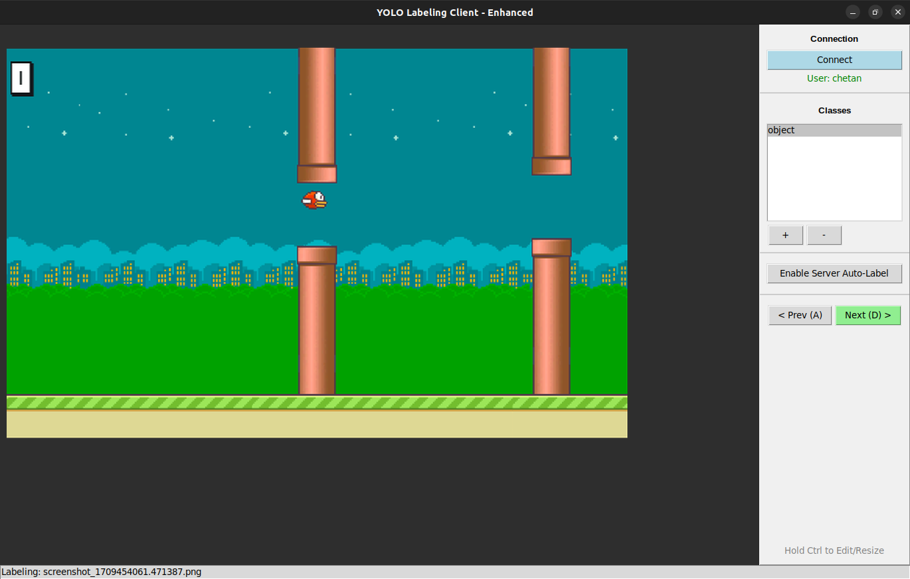
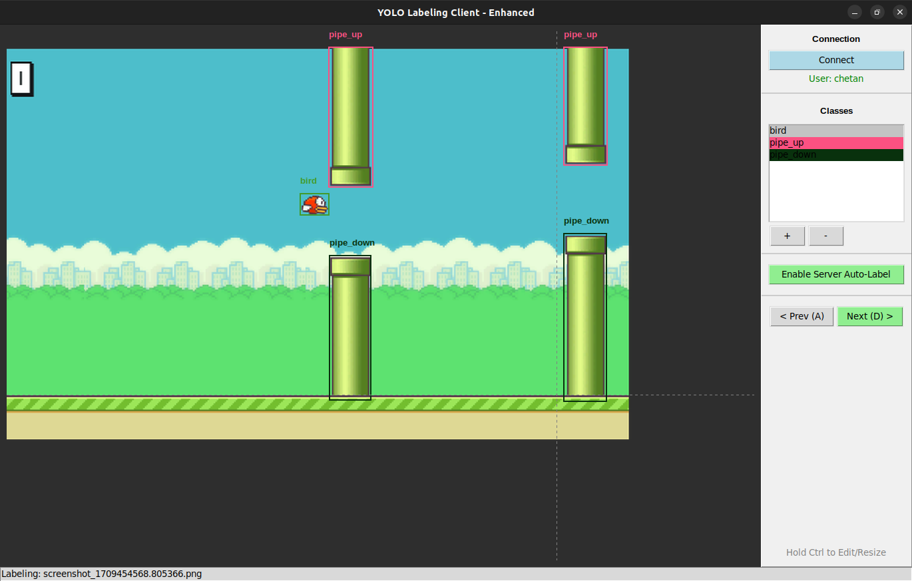
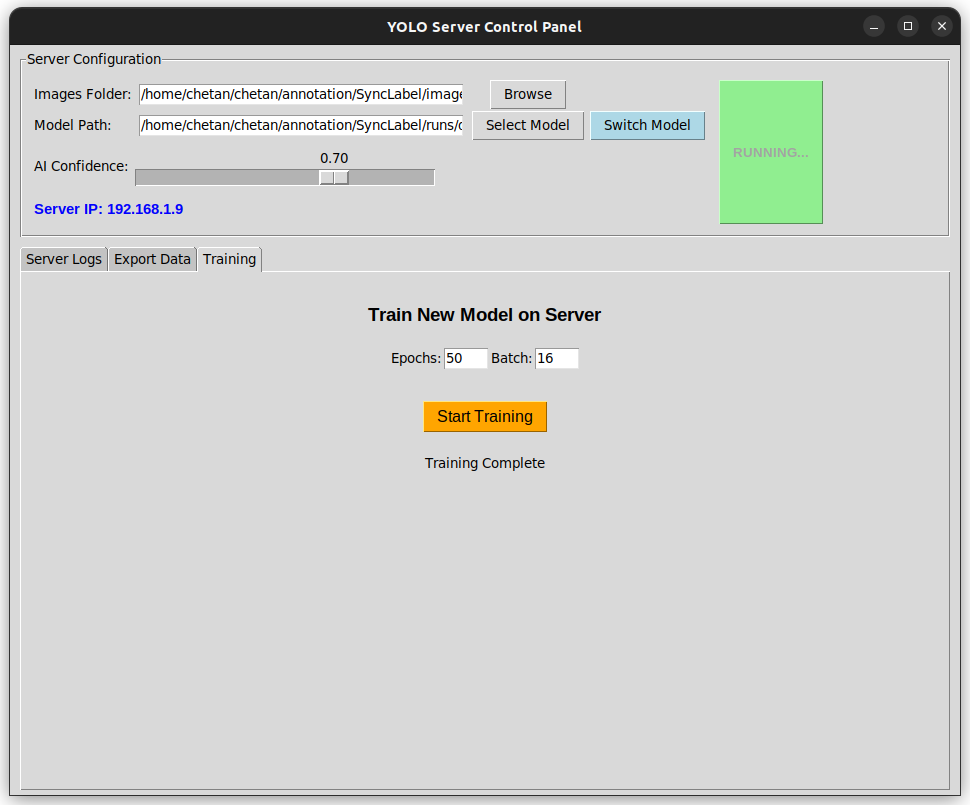
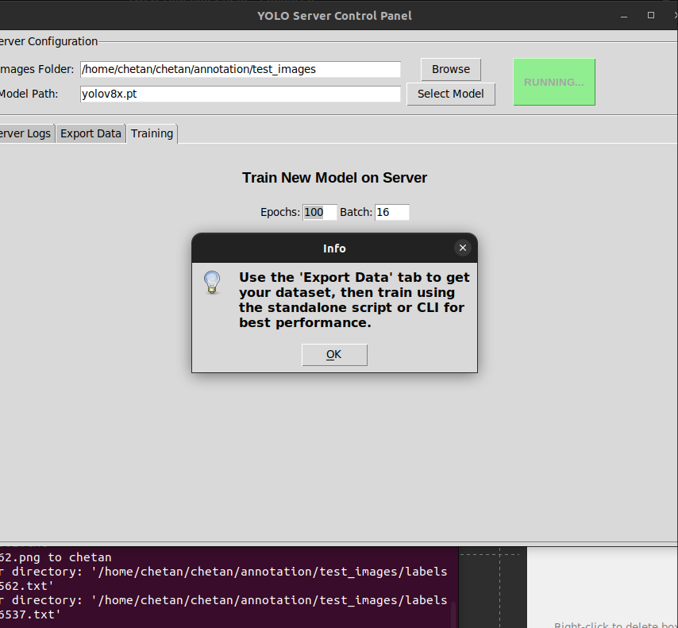

# 🧠 YOLO_Team_Labeler

[](https://www.python.org/)
[](https://github.com/ultralytics/ultralytics)
[](LICENSE)
[](http://makeapullrequest.com)

**A centralized, multi-client image annotation system with server-side YOLO inference and training.**

Designed for **collaborative dataset creation** without data duplication. This platform enables multiple annotators to work in parallel on a shared image pool while a single AI model runs on the server, learns continuously, and serves predictions to all clients.

> **Core Philosophy:** Time is more valuable than compute. By combining human supervision with AI assistance, you can label thousands of images in hours, not days.

---

## 📌 The Problem vs. The Solution

| The Old Way ❌ | The YOLO Team Labeler Way ✅ |
| :--- | :--- |
| **Data Silos:** Images copied to every laptop. | **Centralized:** Images/Labels exist only on the server. |
| **Conflicts:** Labels scattered & duplicate work. | **Parallelism:** Automatic image assignment & locking. |
| **Static:** No feedback loop while labeling. | **Active Learning:** Server trains models on the fly. |
| **Heavy:** Users need powerful GPUs. | **Lightweight:** Clients are thin; Server does the heavy lifting. |

---

## 🔄 The "Active Learning" Workflow

This tool accelerates dataset creation for embedded models through an iterative loop:

1.  **Phase 1: Cold Start (Manual)**
    * Label the first batch of images (approx. 5% of dataset) manually without AI assistance.
2.  **Phase 2: Initial Training**
    * Trigger a training run directly on the server using this small labeled dataset.
3.  **Phase 3: AI-Assisted Labeling**
    * Switch the server to use the newly trained model.
    * **The Speed Boost:** Clients now receive pre-predicted bounding boxes. Users only need to *verify* or *correct* the boxes (`Ctrl` + Drag) rather than drawing from scratch.
4.  **Phase 4: Iterative Improvement**
    * Retrain the model after every ~200 new images.
    * As model accuracy hits >50%, labeling speed doubles.
    * As accuracy hits >80%, users become purely supervisors, enabling rapid processing of massive datasets.

---

## 🏗️ System Architecture

<div align="center">

</div>

### 🧩 Components

| Component | Responsibility | Tech Stack |
| --- | --- | --- |
| **Server** (`server.py`) | **The Brain.** Serves images, prevents conflicts, stores labels, runs YOLO inference, and trains models. | FastAPI, Ultralytics, Pillow, Uvicorn |
| **Client** (`client.py`) | **The Hands.** Connects to server, displays images, captures user input, and requests AI predictions. | Tkinter, Requests, Pillow |

---

## 📸 Application Gallery

<div align="center">

| **1. Raw Input** | **2. AI Prediction** |
| --- | --- |
|  |  |
| *User receives raw image* | *Server sends Auto-Labels* |

| **3. In-App Training** | **4. Data Export** |
| --- | --- |
|  |  |
| *Train directly from GUI* | *Export to YOLO format* |

</div>

---

## 🚀 Getting Started

### 1. Installation

Create a virtual environment and install dependencies:

```bash
python3 -m venv venv
source venv/bin/activate  # On Windows: venv\Scripts\activate
pip install -r requirements.txt

```

### 2. Start the Server

Run the server on the machine that holds the images:

```bash
python3 server.py

```

* **GUI Action:** Select your images folder.
* **GUI Action:** Select a base model (e.g., `yolov8n.pt`).
* **GUI Action:** Click **"Start Server"**.

### 3. Start the Client(s)

Run the client on any machine on the same network:

```bash
python3 client.py

```

* **Login:** Enter the Server IP (e.g., `192.168.1.X`) and your Username.

---

## 🎮 Controls & Shortcuts

| Context | Action | Function |
| --- | --- | --- |
| **Draw** | Left-Click + Drag | Create a new bounding box. |
| **Edit** | `Ctrl` + Drag | **Move** an existing box. |
| **Resize** | `Ctrl` + Drag Corner | **Resize** the specific corner. |
| **Delete** | Right-Click | Delete the box under the cursor. |
| **Nav** | `D` | **Submit** labels & load Next image. |
| **Nav** | `A` | Go to **Previous** image. |
| **Class** | `W` / `S` | Cycle through object classes Up / Down. |

---

## ⚙️ Advanced Details

### Intelligent Label Storage

Labels are stored in standard YOLO `.txt` format in a `labels_collected/` directory on the server.

```text
<class_index> <x_center> <y_center> <width> <height>

```

### Dataset Export

The server includes a one-click export feature that structures your data for external training (e.g., on a cloud GPU cluster):

```text
dataset_export/
├── images/
├── labels/
└── data.yaml  # Ready for Ultralytics/Roboflow

```


## 🤝 Contributing

Contributions are what make the open-source community such an amazing place to learn, inspire, and create. Any contributions you make are **greatly appreciated**.

1. Fork the Project
2. Create your Feature Branch (`git checkout -b feature/Feature`)
3. Commit your Changes (`git commit -m 'Add some Feature'`)
4. Push to the Branch (`git push origin feature/Feature`)
5. Open a Pull Request

## 📄 License

Distributed under the MIT License. See `LICENSE` for more information.

---

<p align="center">
Built by Chetan Parihar
</p>

